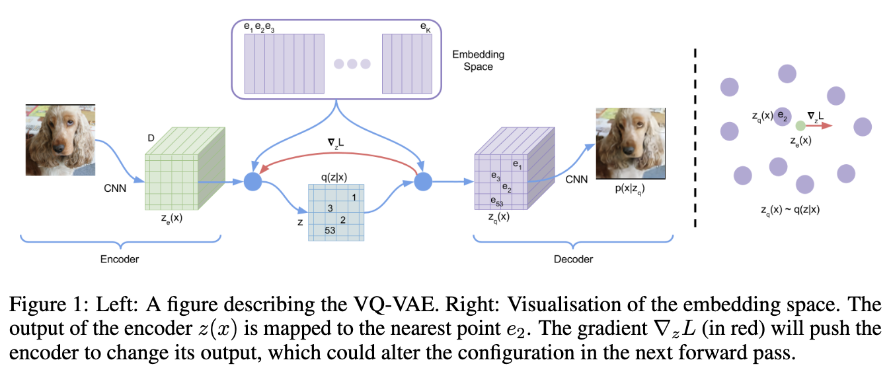
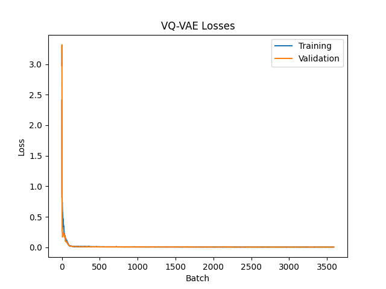
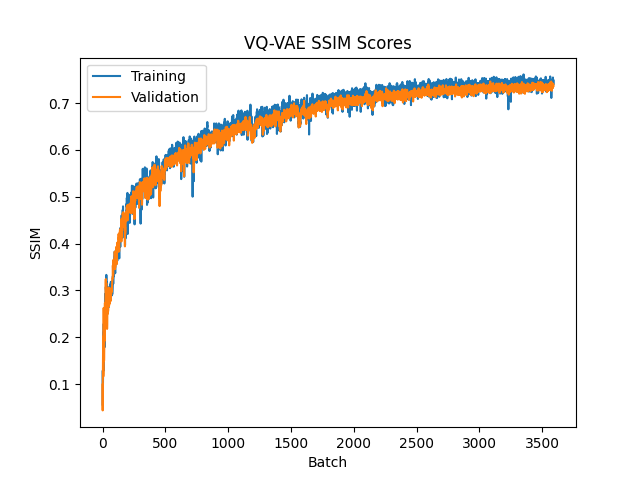
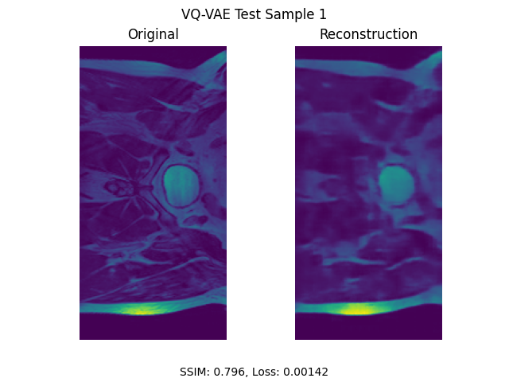
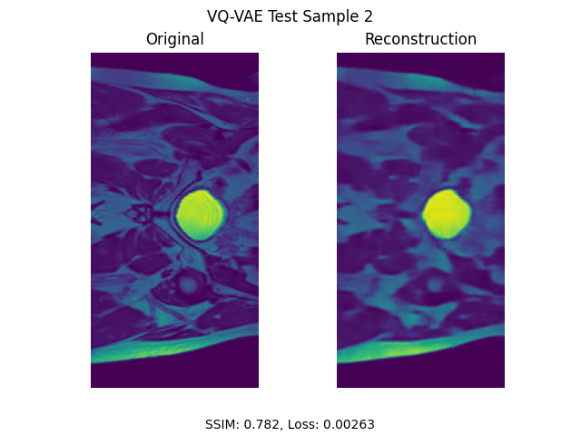
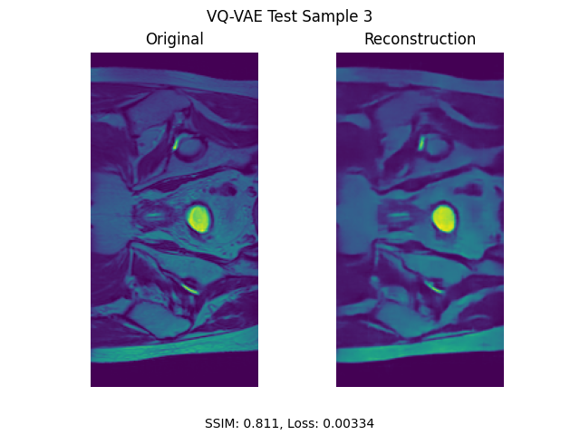
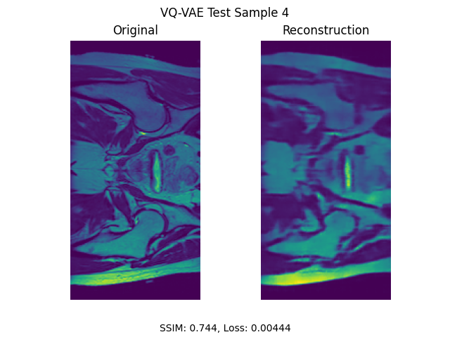

# Question 10 VQ-VAE
Create a generative model of the HipMRI Study on Prostate Cancer using the processed 2D slices (2D
images) available here with the using a VQVAE [12] or VQVAE2 [13] that has a “reasonably clear image”
and a Structured Similarity (SSIM) of over 0.6. [Hard Difficulty]

## Introduction
This project implements and trains a Vector Quantised Variational Autoencoder (VQ-VAE) to compress and reconstruct 2-dimensional images from the HipMRI Study on Prostate Cancer. Analysis of the model used Mean-Squared Error (MSE) loss and the Structural Similarity Index Measure (SSIM) score. Overall, the model effectively learned the key features and structure of the HipMRI slices with an average SSIM scored of > 0.7 on unseen test data.

Instead of learning a continuous distribution in the latent space, the VQ-VAE learns to map the continuous latent space to a set of finite, discrete n-dimensional vectors (embeddings). This is called the "code-book" which contains the embedding space. The encoded input is essentially converted to a vector of the embedding indices. These indices are then mapped back into a continuous latent space for use by a Decoder. By using discrete representations of the latent space, the model is able to learn the structure and patterns within the inputs more effectively and efficiently than traditional Variational Autoencoders.



## Model Structure
The implemented VQ-VAE utilises components from a vanilla VAE, specifically the Encoder and Decoder. However, a Vector Quantisation module replaces the typical reparameterisation layer.

### Encoder
The Encoder structure is a standard down-sampling neural network. It is composed of down-sampling blocks which halve the height and width dimensions of the input while increasing the number of channels. Each down-sampling block contains (in-order):
1. 2-D Convlolution: 
2. 2-D Batch Normalisation:
3. LeakyReLU:
4. 2-D Max Pooling:

### Decoder
The Decoder is a standard up-sampling neural network, desgined to reverse the down-sampling from the Encoder. The up-sampling blocks perform the reverse of the down-sampling blocks, decreasing the channels and doubling the height and width dimensions. An up-sampling block is composed of:
1. 2-D Transpose Convolution:
2. LeakyReLU:
The output of the Decoder the same dimensionality as the original input.

### Vector Quantiser
The Vector Quantiser (VQ) converts the continuous latent space from the Encoder into a set of embeddings within a finite n-dimensional space. Distinct subsets of the latent space are assigned to the "nearest" embedding in this space (Using the Eucildean distance for n-dimensions). The indices of these nearest embeddings can then be used for compressed image storage or reconverted back into a continuous latent space for reconstruction by the Decoder.

## Data Processing
All HipMRI images were normalised before use in the training, validation, and testing. The data has also been pre-divided into the train set (11,460 images), validation set (660 images), and test set (540 images).

A small number of the HipMRI images had different dimensions compared to the majority of images. These images were either cropped or padded so all images shared the same height and width dimensions. This was done to allow all images to be used with the model.

### Model Parameters
The implementation of the VQ-VAE requires certain model parameters to be specified at initialisation.
- **Input Channels**: The input channels for the network, was implemented for grey-scale images and is set to 1.

- **Output Channels**: The output channels are parsed as a list of outputs for each layer of both the Encoder and Decoder. The number of elements in this list determines the number of down-sampling and up-sampling layers present in the Encoder and Decoder respectively. The value used for training was [128,256,512]. This provided a suitable balance between image compression and channel count. Using more layers and channels caused the training to encounter memory issues with the available hardware, and fewer layers did not suitably learn features of the images.
- **Kernel Size**: The kernel size used for both the Encoder and Decoder. This was set to 3 (3x3) and was sufficient for the convolutions required.

- **Embedding Number**: The number of discrete values present in the VQ code book. A large range of values were tested between 0 and 2048, though a value of 32 provided the most promising results.

- **Embedding Dimension**: The dimensionality of each value in the VQ code book. The training used 64-dimensional code book vectors which complemented the embedding number of 32 to provide accurate reconstructions.

### Hyper-Parameters
The hyper-parameters were chosen by training, then evaluating the model at intervals within a range of reasonable values.

- **Batch Size**: A batch size of 32 was used to take advantage of the available hardware. This was considered to be the maximum value that the GPU could handle. While this size decreased the training time per epoch, it also decreased the average SSIM score achieved when testing. This is likely due to the learning rate not being adjusted to accomodate the larger batch size. A batch size of 1 showed the greatest average SSIM when trained on a single epoch compared to larger batches.

- **Epochs**: The training ran for 10 epochs. Running the training for fewer epochs resulted in models which, when the average loss and SSIM were plotted, suggested further training would provide a reasonable benefit to its performance.

- **Learning Rate**: The learning rate was set to 5e-3 to account for the batch size of 32. For a batch size of 1, a value of 5e-4 would be more appropriate given the greater number of iterations per epoch. Learning rates within the range of 1e-2 and 1e-6 were tested. During training, this value was adjusted between epochs using a learning rate scheduler.

- **Commitment Cost**: The model uses a commitment cost of 1.0 for training. The commit cost is typically set to 0.25 as is considered the standard by other VQ-VAE implementations [1][VQ-VAE], however this value led to a poorer performing model.

## Training
The model was trained using the parameters and hyper-parameters stated above.

An Adam optimiser is used during training to update the model parameters.

The training uses a Cosine Annealing learning rate scheduler to smoothly reduce the learning rate over the total number of epochs. This addition allowed the model to better learn the fine details of the images during later epochs. Training models using Linear and Step schedulers were also attempted, though these performed marginally worse.

### Loss Function
The loss function uses the standard MSE loss function and a simple Vector Quantisation term.

The MSE loss function is used to calculate the reconstruction loss of the predicted vs input images.
$$
    L_{recon} = || \ x - \hat{x} \ ||^2 \\
$$
This calculation is not affected by the Vector Quantiser embedding space, meaning that to back-propagate the VQ, another component must be added to the overall loss function.

A simple Vector Quantisation loss function is used to enable the embeddings to learn the overall image structure and patterns. This is split into the codebook loss and the commitment loss components. The codebook loss is used in the back-propagation to move the embeddings, $e$ closer to the corresponding encoder values, $z_e(x)$. The $sg$ function refers to the "stop gradient" operator which is used to prevent back-propagation on this variable.
$$ 
    L_{codebook} = || \ sg[z_e(x)] - e \ ||^2
$$
The commitment loss component makes the encoder "commit" to an embedding. Additionally the $\beta$ is a scaler of the commitment loss to make sure the encoder output does not increase faster than the embeddings.
$$
    L_{commit} = \beta * || \ z_e(x) - sg[e] \ ||^2
$$

The overall loss function is then the sum of these three components, 
$$
    L = L_{recon} + L_{codebook} + L_{commit}
$$
A plot of the loss function during training can be seen below.



### SSIM Scores
The Structural Similarity Index Metric is used to evaluate the performance of the compression performed on the HipMRI. It compares structure, luminance, and contrast of the reconstructed image against the original, returning a value between 0 (no similarity) and 1 (identical). 



## Results

The final model achieved an average SSIM score of 0.766 on the test set.
Examples of the input vs reconstruction are shown below.










## Reproducing Results

To reproduce the results the following steps can be taken:

1. **Dependencies**: Ensure the dependencies listed below are installed.
2. **Change Directory**: Set the current directory to ```./recognition/VQ-VAE-s4578267```
3. **Image Files**: The data is stored as .nii files in the following structure:
```
./data/keras_slices_data/
    - keras_slices_train/
    - keras_slices_validate/
    - keras_slices_test/
``` 
4. **Train Model**: Train the model by running ```train.py```. The trained model and plots will be saved in ```./training/```.
5. **Use Model**: After step 4, run the ```predict.py``` script. This will generate ten images in ```./testing/``` which compare the original vs reconstruction of images from the test set.

### Dependencies
- matplotlib - 3.10.7
- numpy - 1.26.4
- nibabel - 5.3.2
- torch - 2.2.2
- torchmetrics - 1.8.2
- torchvision - 0.17.2
- tqdm - 4.67.1

## References

1. Oord, A. van den, Vinyals, O., & Kavukcuoglu, K. (2018, May 30). Neural Discrete Representation Learning. ArXiv.org. https://doi.org/10.48550/arXiv.1711.00937
(#VQ-VAE): https://doi.org/10.48550/arXiv.1711.00937  "VQ-VAE Article"
‌
2. Luke Ditria. (2024, November 19). Creating a Vector Quantized VAE from Scratch! PyTorch Deep Tutorial. YouTube. https://www.youtube.com/watch?v=ZNRNddl9owI